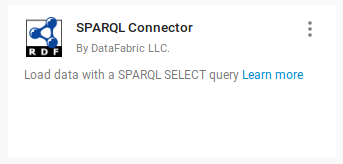
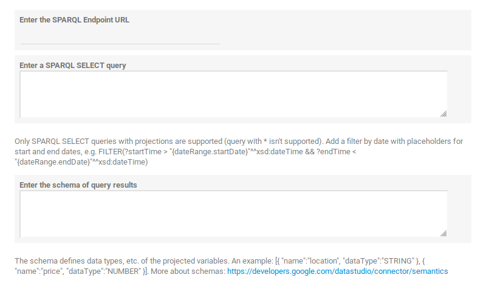

# SPARQL Connector for Google Data Studio

It allows to load data from a SPARQL endpoint using SELECT queries.



## Getting started

1. Open the [link](https://datastudio.google.com/datasources/create?connectorId=AKfycbzDHEBN9qHXPni4xO4P2cIZtyQ3rnYmzkCnVsnh9oEJrnhGe4MntBF-t1zAu2Lm-Vjc) to create a new Data Source.
1. Once authorization has successfully completed, you're ready to configure the parameters. You should see the form:

    

1. Enter the SPARQL endpoint URL, e.g. http://dbpedia.org/sparql
1. Enter your SELECT query, e.g.

    ```
    PREFIX dbr: <http://dbpedia.org/resource/>
    PREFIX dbo: <http://dbpedia.org/ontology/>
    PREFIX foaf: <http://xmlns.com/foaf/0.1/>
    PREFIX xsd: <http://www.w3.org/2001/XMLSchema#>

    SELECT ?name ?gender ?birthDate WHERE {
      ?person dbo:birthPlace dbr:Berlin ;
              dbo:birthDate ?birthDate ;
              foaf:name ?name ;
              foaf:gender ?gender .

       FILTER (?birthDate > "{dateRange.startDate}"^^xsd:date && ?birthDate < "{dateRange.endDate}"^^xsd:date) .
    }
    ```

    The following variables are supported:

    * `dateRange.startDate` - format `YYYY-MM-DD`, e.g. 2018-10-01,
    * `dateRange.endDate` - format `YYYY-MM-DD`, e.g. 2018-10-01,
    * `dateRange.numDays` - it's a positive integer value.

    If you don't use `dateRange.startDate` or `dateRange.endDate`, then **Date range** filter won't be able to control the date range.

1. Enter the schema of projections, e.g.

    ```
    [
        {"name": "name", "dataType": "STRING"},
        {"name": "gender", "dataType": "STRING"},
        {"name": "birtDate", "dataType": "STRING"}
    ]
    ```

    At this step is enough to set only data types for each projection, at the next step you'll be able to refine it. More about the schema elements, data types you can read in https://developers.google.com/datastudio/connector/semantics.

1. Press **Connect** button and the next page is the same for all connectors.

## Supported data type conversions

Google Data Studio uses it's own formats for some of the data types. Therefore the connector automatically converts them. The following data types are supported:

* `xsd:date` is converted to `YYYYMMDD`,
* `xsd:dateTime` is converted to `YYYYMMDDHH`,
* `xsd:duration` is converted to an integer corresponding to the number of seconds.

## Default values

The connector may apply default values in query results which don't a value for a requested field. The default values:

Datatype   | Default value
-----------|--------------
`NUMBER`   | `0`
`BOOLEAN`  | `false`
`STRING`   | `""`

If you don't like these defaults, then write your query in a way when it can't have missing/empty values, especially in case of `GROUP BY`.

## License

MIT License

